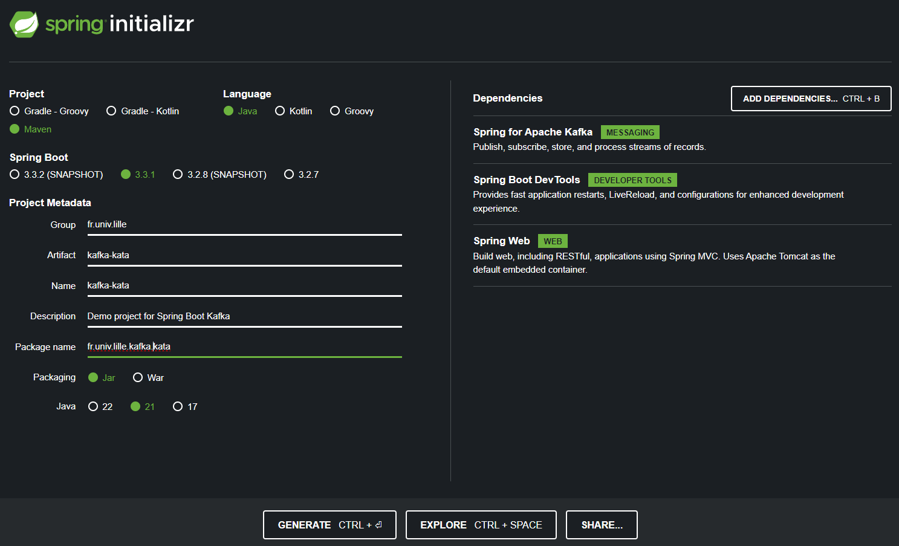
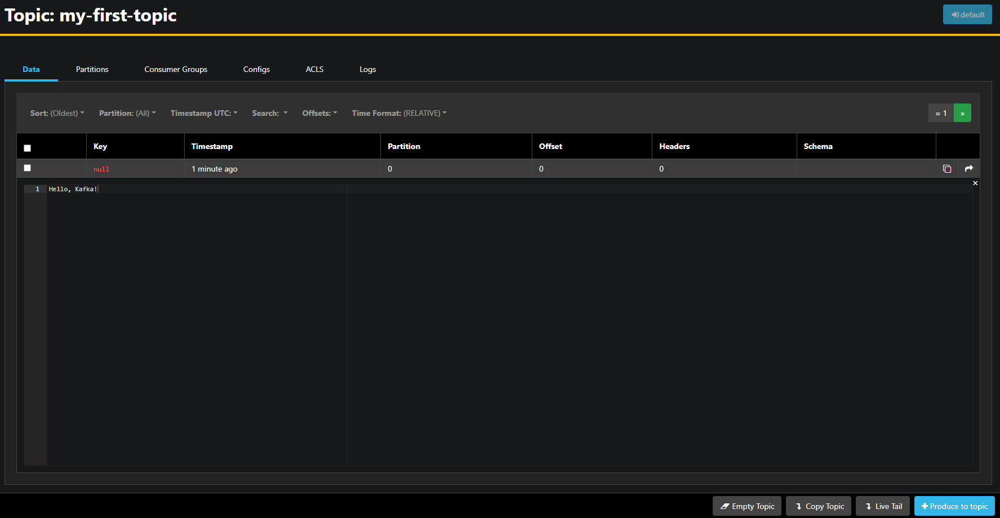

# Spring Kafka Kata

Nous allons voir dans ce kata comment utiliser Spring Kafka pour produire et consommer des messages.

## Introduction

### Architecture EDA

L'architecture Event-Driven Architecture (EDA) est un style d'architecture logicielle qui favorise la production, la détection, la consommation et la réaction aux événements. Un événement est un changement de l'état d'une entité qui est détecté par un émetteur et peut être consommé par un ou plusieurs récepteurs. Les événements peuvent être de nature variée, par exemple, un événement peut être un message, une notification, une alerte, une erreur, etc. L'EDA est basée sur le principe de la séparation des préoccupations, où les émetteurs et les récepteurs sont indépendants les uns des autres. L'EDA est utilisée dans de nombreux cas d'utilisation, par exemple, la gestion des données en temps réel, la surveillance des applications, l'analyse en temps réel, la gestion des données IoT, etc. L'EDA est mise en œuvre à l'aide de plusieurs technologies, par exemple, Apache Kafka, RabbitMQ, Amazon Kinesis, etc. L'EDA est basée sur le principe de la publication/abonnement (pub/sub) où les émetteurs publient des événements sur des topics et les récepteurs consomment des événements à partir de ces topics.

### Apache Kafka

Apache Kafka est une plateforme de streaming distribuée qui permet de publier, de stocker et de consommer des flux de données en temps réel. Kafka est conçu pour être scalable, durable et tolérant aux pannes. Kafka est utilisé dans de nombreux cas d'utilisation, par exemple, le traitement des logs, la surveillance des applications, l'analyse en temps réel, la gestion des données IoT, etc. Kafka stocke les messages dans des topics sous forme de partitions. Chaque partition est un ordre total des messages et est répliquée sur plusieurs brokers pour garantir la tolérance aux pannes. Kafka fournit des garanties de livraison des messages, de persistance des messages et de réplication des messages. Kafka fournit également des fonctionnalités de streaming, de transformation et de requête des données. Kafka fournit des clients pour plusieurs langages de programmation, par exemple, Java, Python, Go, etc.

### Spring Kafka

Spring Kafka est un projet Spring qui fournit une intégration de Kafka pour les applications Spring. Spring Kafka fournit un support pour la production et la consommation de messages Kafka. Spring Kafka fournit un modèle de programmation basé sur des annotations pour la production et la consommation de messages Kafka. Spring Kafka fournit un support pour la configuration des clients Kafka, la sérialisation/désérialisation des messages, la gestion des erreurs, la gestion des transactions, etc. Spring Kafka fournit également un support pour les tests unitaires et les tests d'intégration des applications Kafka.

## Docker Compose

Nous allons utiliser Docker Compose pour démarrer un cluster Kafka local. Créez un fichier `docker-compose.yml` avec le contenu suivant :

```yaml
version: "3.9"

services:

  kata-akhq:
    image: tchiotludo/akhq
    environment:
      AKHQ_CONFIGURATION: |
        akhq:
          connections:
            docker-kafka-server:
              properties:
                bootstrap.servers: "kata-kafka:29092"

    ports:
      - 3000:8080
    links:
      - kata-kafka
    depends_on:
      - kata-kafka_init

  kata-zookeeper:
    image: confluentinc/cp-zookeeper
    volumes:
      - zookeeper-data:/var/lib/zookeeper/data:Z
      - zookeeper-log:/var/lib/zookeeper/log:Z
    environment:
      ZOOKEEPER_CLIENT_PORT: '2181'
      ZOOKEEPER_ADMIN_ENABLE_SERVER: 'false'

  kata-kafka:
    image: confluentinc/cp-kafka
    volumes:
      - kafka-data:/var/lib/kafka/data:Z
    environment:
      KAFKA_BROKER_ID: '0'
      KAFKA_ZOOKEEPER_CONNECT: 'kata-zookeeper:2181'
      KAFKA_NUM_PARTITIONS: '12'
      KAFKA_COMPRESSION_TYPE: 'gzip'
      KAFKA_OFFSETS_TOPIC_REPLICATION_FACTOR: '1'
      KAFKA_TRANSACTION_STATE_LOG_REPLICATION_FACTOR: '1'
      KAFKA_TRANSACTION_STATE_LOG_MIN_ISR: '1'
      KAFKA_LISTENER_SECURITY_PROTOCOL_MAP: PLAINTEXT:PLAINTEXT,PLAINTEXT_HOST:PLAINTEXT
      KAFKA_LISTENERS: PLAINTEXT://:29092,PLAINTEXT_HOST://:9092
      KAFKA_ADVERTISED_LISTENERS: PLAINTEXT://kata-kafka:29092,PLAINTEXT_HOST://localhost:9092
      KAFKA_CONFLUENT_SUPPORT_METRICS_ENABLE: 'false'
      KAFKA_JMX_PORT: '9091'
      KAFKA_AUTO_CREATE_TOPICS_ENABLE: 'true'
      KAFKA_AUTHORIZER_CLASS_NAME: 'kafka.security.authorizer.AclAuthorizer'
      KAFKA_ALLOW_EVERYONE_IF_NO_ACL_FOUND: 'true'
    links:
      - kata-zookeeper
    ports:
      - 9092:9092

  kata-kafka_init:
    image: confluentinc/cp-kafka
    depends_on:
      - kata-kafka
    restart: "no"
    entrypoint: ["/bin/sh", "-c"]
    command: |
      "
      # blocks until kafka is reachable
      kafka-topics --bootstrap-server kata-kafka:29092 --list
      # alternatively with cp: cub kafka-ready -b kafka:29092 1 30 &&

      # just to make sure everything else are done
      sleep 5

      echo 'Creating kafka topics'
      
      kafka-topics --bootstrap-server kata-kafka:29092 --topic my-first-topic --create --partitions 3 --replication-factor 1 --if-not-exists

      echo 'Successfully created the following topics:'
      kafka-topics --bootstrap-server kata-kafka:29092 --list
      "

volumes:
  zookeeper-data:
    driver: local
  zookeeper-log:
    driver: local
  kafka-data:
    driver: local
```

Ce fichier Docker Compose définit quatres services :

- `kata-zookeeper` : un service Zookeeper pour la gestion des brokers Kafka. Zookeeper est utilisé par Kafka pour la gestion des brokers, des topics et des partitions.
- `kata-kafka` : un service Kafka pour la gestion des topics Kafka. Kafka est utilisé pour la production et la consommation des messages.
- `kata-kafka_init` : un service Kafka pour l'initialisation des topics Kafka. Ce service crée un topic Kafka `my-first-topic` avec 3 partitions et un facteur de réplication de 1.
- `kata-akhq` : un service AKHQ pour la gestion des topics Kafka. AKHQ est une interface utilisateur pour la gestion des topics Kafka.

Pour démarrer le cluster Kafka local, exécutez la commande suivante :

```bash
docker-compose up -d
```

Ensuite, ouvrez l'interface utilisateur AKHQ à l'adresse `http://localhost:3000` dans votre navigateur Web. Vous devriez voir l'interface utilisateur AKHQ avec les détails du cluster Kafka local. Vous devriez voir le topic `my-first-topic` avec 3 partitions et un facteur de réplication de 1.

## Initialisation du projet

Utilisez [Spring Initializr](https://start.spring.io/) pour initialiser un projet Spring Boot avec les dépendances suivantes :

- Spring Boot DevTools
- Spring Web
- Spring for Apache Kafka

Cliquez sur le bouton `Generate` pour télécharger le projet Spring Boot. Extrayez le projet téléchargé dans un répertoire de votre choix. Importez le projet dans votre IDE préféré en tant que projet Maven.



## Configuration de Kafka

Ajoutez les propriétés de configuration Kafka dans le fichier `application.properties` :

```properties
spring.kafka.producer.bootstrap-servers=localhost:9092
spring.kafka.consumer.bootstrap-servers=localhost:9092
spring.kafka.consumer.group-id=my-first-group
```

Ces propriétés de configuration définissent les adresses des brokers Kafka, le groupe de consommateurs Kafka et le topic Kafka.

## Production de messages

Créez un producteur Kafka pour produire des messages dans le topic Kafka. Créez une classe `KafkaProducer` avec la méthode `produce` :

```java
package fr.spring.kata.kafka;

import org.springframework.kafka.core.KafkaTemplate;
import org.springframework.stereotype.Service;

@Service
public class KafkaProducer {

    private final KafkaTemplate<String, String> kafkaTemplate;

    public KafkaProducer(KafkaTemplate<String, String> kafkaTemplate) {
        this.kafkaTemplate = kafkaTemplate;
    }

    public void produce(String message) {
        kafkaTemplate.send("my-first-topic", message);
    }
}
```

Cette classe `KafkaProducer` utilise le `KafkaTemplate` pour envoyer un message dans le topic `my-first-topic`. Le message est envoyé sous forme de chaîne de caractères. Le `KafkaTemplate` est un client Kafka qui fournit des méthodes pour envoyer des messages dans un topic Kafka.

Pour produire des messages, créez un contrôleur REST avec une méthode POST pour envoyer un message dans le topic Kafka. Créez une classe `KafkaController` avec la méthode `produce` :

```java
package fr.spring.kata.kafka;

import org.springframework.web.bind.annotation.PostMapping;
import org.springframework.web.bind.annotation.RequestBody;
import org.springframework.web.bind.annotation.RestController;

@RestController
public class KafkaController {

    private final KafkaProducer kafkaProducer;

    public KafkaController(KafkaProducer kafkaProducer) {
        this.kafkaProducer = kafkaProducer;
    }

    @PostMapping("/messages")
    public void produceMessage(@RequestBody String message) {
        kafkaProducer.produce(message);
    }
}
```

Cette classe `KafkaController` utilise le `KafkaProducer` pour envoyer un message dans le topic `my-first-topic`. La méthode `produceMessage` est une méthode POST qui reçoit un message sous forme de chaîne de caractères et l'envoie dans le topic Kafka. Vous pouvez tester cette méthode en utilisant un client REST comme Postman ou curl, le contenu du message sera visible depuis l'interface utilisateur AKHQ. Pour tester cette méthode, exécutez l'application Spring Boot et exécutez la commande curl suivante :

```bash
curl -X POST -H "Content-Type: application/json" -d "Hello, Kafka!" http://localhost:8080/messages
```



## Consommation de messages

Créez un consommateur Kafka pour consommer des messages du topic Kafka. Créez une classe `KafkaConsumer` avec la méthode `consume` :

```java
package fr.spring.kafka.kata;

import org.apache.kafka.clients.consumer.ConsumerRecord;
import org.slf4j.Logger;
import org.slf4j.LoggerFactory;
import org.springframework.kafka.annotation.KafkaListener;
import org.springframework.stereotype.Component;

import java.util.ArrayList;
import java.util.Collections;
import java.util.List;

@Component
public class KafkaConsumer {

    private final static Logger LOGGER = LoggerFactory.getLogger(KafkaConsumer.class);

    private List<String> messages = Collections.synchronizedList(new ArrayList<>());

    @KafkaListener(topics = "my-first-topic", groupId = "my-first-group")
    public void consume(ConsumerRecord<String, String> record) {
        LOGGER.info("Consumed message: {}", record.value());
        messages.add(record.value());
    }

    public List<String> getMessages() {
        return messages;
    }
}

```

Cette classe `KafkaConsumer` utilise l'annotation `@KafkaListener` pour écouter les messages du topic `my-first-topic` avec le groupe de consommateurs `my-first-group`. La méthode `consume` est appelée chaque fois qu'un message est consommé du topic Kafka. La méthode `consume` affiche le contenu du message sur la console. Vous pouvez tester cette méthode en envoyant un message à l'application Spring Boot, le contenu du message sera affiché sur la console.

## Les tests avec Testcontainers

Pour les tests d'intégration, nous allons utiliser Testcontainers pour démarrer un cluster Kafka local. Ajoutez la dépendance Testcontainers Kafka dans le fichier `pom.xml` :

```xml
<dependency>
    <groupId>org.testcontainers</groupId>
    <artifactId>junit-jupiter</artifactId>
    <scope>test</scope>
</dependency>
<dependency>
    <groupId>org.testcontainers</groupId>
    <artifactId>kafka</artifactId>
    <scope>test</scope>
</dependency>
<dependency>
    <groupId>org.awaitility</groupId>
    <artifactId>awaitility</artifactId>
    <scope>test</scope>
</dependency>
```

Créez une classe de test `KafkaTest` avec la méthode `testProduceConsume` :

```java
package fr.spring.kafka.kata;

import static java.util.concurrent.TimeUnit.SECONDS;
import static org.assertj.core.api.Assertions.assertThat;
import static org.awaitility.Awaitility.await;
import static org.springframework.test.web.servlet.request.MockMvcRequestBuilders.post;
import static org.springframework.test.web.servlet.result.MockMvcResultMatchers.status;

import org.junit.jupiter.api.Test;
import org.springframework.beans.factory.annotation.Autowired;
import org.springframework.boot.test.autoconfigure.web.servlet.AutoConfigureMockMvc;
import org.springframework.boot.test.context.SpringBootTest;
import org.springframework.test.context.DynamicPropertyRegistry;
import org.springframework.test.context.DynamicPropertySource;
import org.springframework.test.web.servlet.MockMvc;
import org.testcontainers.containers.KafkaContainer;
import org.testcontainers.junit.jupiter.Container;
import org.testcontainers.junit.jupiter.Testcontainers;
import org.testcontainers.utility.DockerImageName;

import java.time.Duration;
import java.util.List;

@SpringBootTest
@AutoConfigureMockMvc
@Testcontainers
class KafkaTest {

    @Container
    static final KafkaContainer kafka = new KafkaContainer(
          DockerImageName.parse("confluentinc/cp-kafka:5.4.3")
    );

    @DynamicPropertySource
    static void overrideProperties(DynamicPropertyRegistry registry) {
        registry.add("spring.kafka.producer.bootstrap-servers", kafka::getBootstrapServers);
        registry.add("spring.kafka.consumer.bootstrap-servers", kafka::getBootstrapServers);
    }

    @Autowired
    private MockMvc mockMvc;
    @Autowired
    private KafkaConsumer kafkaConsumer;

    @Test
    void testProduceConsume() throws Exception {
        String message = "Hello, Kafka!";

        mockMvc.perform(post("/messages").content(message)).andExpect(status().isOk());

        await()
              .pollInterval(Duration.ofSeconds(3))
              .atMost(10, SECONDS)
              .untilAsserted(() -> {
                    assertThat(kafkaConsumer.getMessages()).hasSize(1);

                  assertThat(kafkaConsumer.getMessages()).containsAll(List.of(message));
              });
    }
}

```

Que se passe-t-il dans ce test :

- Nous utilisons Testcontainers pour démarrer un cluster Kafka local.
- `@DynamicPropertySource` permet de remplacer les propriétés de configuration Kafka par les adresses des brokers Kafka.
- `@Autowired` est utilisé pour injecter le client MockMvc et le consommateur Kafka.
- Nous utilisons `@Test` pour définir la méthode de test `testProduceConsume`.
- Nous faisons appel à `mockMvc.perform` pour envoyer un message au contrôleur REST.
- Le contrôleur REST envoie le message dans le topic Kafka.
- Nous utilisons `await` pour attendre que le message soit consommé par le consommateur Kafka.
- Et enfin avec `assertThat` nous vérifions que le message a été consommé avec succès.

## Conclusion

Dans ce kata, nous avons vu comment utiliser Spring Kafka pour produire et consommer des messages. Nous avons vu comment configurer Kafka, produire des messages, consommer des messages et tester les applications Kafka. Nous avons également vu comment utiliser Testcontainers pour démarrer un cluster Kafka local pour les tests d'intégration. Vous pouvez maintenant explorer d'autres fonctionnalités de Spring Kafka, par exemple, la gestion des erreurs, la gestion des transactions, la sérialisation/désérialisation des messages, etc.

## Pour aller plus loin

Nous n'avons fait qu'effleurer la surface de Spring Kafka. Vous pouvez explorer d'autres fonctionnalités de Spring Kafka, par exemple, la gestion des erreurs, la gestion des transactions, la sérialisation/désérialisation des messages, etc. Dans la plupart des projets réels, le cluster Kafka sera protégé par un mécanisme d'authentification et d'autorisation.

Vous pouvez gérer les erreurs de production et de consommation de messages en utilisant les mécanismes de rejeu, de rééquilibrage et de réinitialisation des offsets. Vous pouvez également gérer les erreurs de sérialisation/désérialisation des messages en utilisant des sérialiseurs/désérialiseurs personnalisés. Il y a également des patterns avancés de résilience comme la Dead Letter Queue (DLQ) voir même l'utilisation d'un proxy Kafka.

L'idempotence est un autre point important à considérer, surtout pour les consommateurs. En effet, un consommateur doit être capable de traiter plusieurs fois le même message sans effet de bord.

Dans un contexte de microservices, vous pouvez être amené à entendre parler de Pattern SAGA. Il s'agit d'un pattern de conception qui permet de gérer les transactions distribuées entre plusieurs services. Kafka peut être utilisé pour implémenter ce pattern.

Enfin, Kafka Streams est une API de traitement des événements qui permet de traiter les flux de données en temps réel. Kafka Streams fournit des fonctionnalités de transformation, de filtrage, de jointure et d'agrégation des données. Kafka Streams peut être utilisé pour implémenter des pipelines de traitement des données en temps réel. Il est possible de créer des tables de données que l'on appelle ktables qui peuvent être jointes, filtrées, transformées, etc. avec un langage de requête SQL-like.

## Références

- [Apache Kafka](https://kafka.apache.org/)
- [Spring Kafka](https://spring.io/projects/spring-kafka)
- [Testcontainers](https://www.testcontainers.org/)
- [AKHQ](https://akhq.io/)
- [Kafka Streams](https://kafka.apache.org/documentation/streams/)